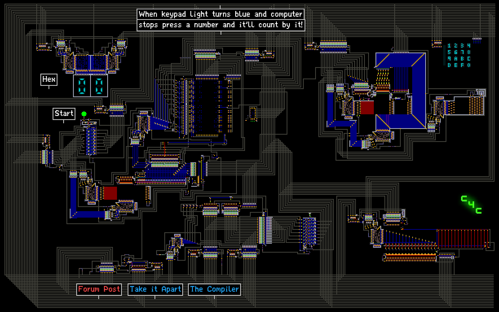
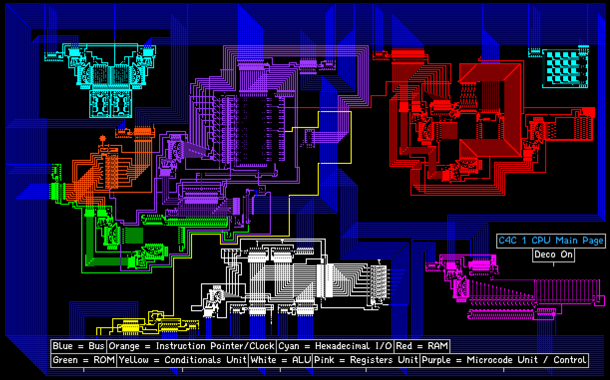
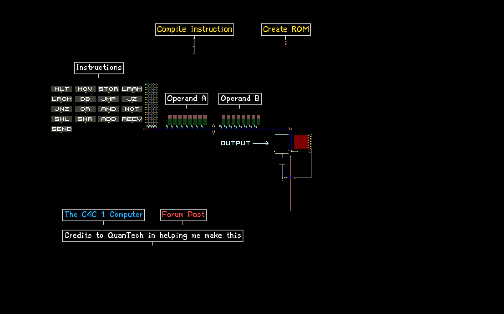

# C4C1 Simulated CPU Project


[C4C1 Computer Simulator Page](http://powdertoy.co.uk/Browse/View.html?ID=2148569)


[C4C1 Disassembled Simulator Page](https://powdertoy.co.uk/Browse/View.html?ID=2148574)


[C4C1 Compiler Simulator Page](http://powdertoy.co.uk/Browse/View.html?ID=2149714)

## Intro

Hey guys. I have finally finished a project that I have been working on for months

now, my very own PowderToy computer! The C4C 1 8-bit Computer is now fully functional,

complete with detailed documentation and a block diagram of the internals. I am very proud

to join the community of people who develop complex electronics and computers on TPT.

You guys are truly amazing, and the feats you accomplish together as a

community are incredible (60 hz computer, GPU, video game inside a video game, etc.)

I hope now to play my part in this incredible community.

## Detailed Specifications

Before we get into the computer, here is a complete specification for further reading:

- [C4C 1 Computer Specification](SPECIFICATION)

And here is the block diagram:

- [C4C1 Computer Block Diagram](computer_diagram_digitized_final.pdf)

## Features

- An 8-bit Semi-Von Neumann architecture (data/addresses are 8 bits wide at maximum)
- A 256 byte ROM and 256 byte RAM
- 16 general purpose registers (AX - PX)
- Hexadecimal keyboard and display
- A 7 function ALU
- 16 assembly instructions
- A microcoded CPU
- OLD TECHNOLOGY!!! We&#39;ve got ARAY/FILT/INST, and even a subframe ray gun! See if you can find it.
- A 0.02 HZ cycle speed to teach patience

## Programming Instructions

Finally, we get to the programming reference. You need technical knowledge for this section. It is taken from the reference. In the ROM, data is stored in filt (a light filter element). Filt uses a hex number which corresponds to a 30-bit wavelength in the CTYPE, adapted from storing colors to encoding instructions/data:

_Instruction Bitfield_:

- ```[11111][xxxx][xxxxxxxx][xxxxxxxx][00000]``` where INST = which instruction
- ```[IDENT][INST][OPERANDA][OPERANDB][EMPTY]```

_Data Bitfield_:

- ```[0000000000000000000000][xxxxxxxx]```
- ```[_______ UNUSED _______][_ DATA _]```

_Register Bitfield_ (for use in operands):

- ```[0000][xxxx]``` where addr = address of register from 0 - 15 (AX - PX)
- ```[NONE][ADDR]```

And an assembly instruction corresponding to instructions or data:

- Instruction: ```[MNEMONIC] [OPERANDA], [OPERANDB]```
- Data: ```DB [8BIT-BYTE]```

**Update: Use the compiler linked at top, type assembly instruction, followed by binary operands into compiler, then press compile instruction. When done with entire program, press create image and copy that ROM.**

To program the C4C 1 CPU in PowderToy, there are several steps you need to take:

1. Write out the instruction in assembly mnemonics, e.g. MOV AX, BX
2. Find the binary address corresponding to the instruction, e.g. 0001 for MOV
3. Encode the operands in binary, e.g. OPERANDA[AX] becomes 00000000 and OPERANDB[BX] becomes 00000001
4. Put the instruction together in binary, with the identifier at the front, followed by the binary instruction address, followed by the operands, and lastly the sequence 00000 e.g. 11111 + 0001 + 00000000 + 00000001 + 00000 =&gt; 111110001000000000000000100000
5. Convert the instruction from binary to hex, e.g. 111110001000000000000000100000 =&gt; 0x3E200020
6. Set the PROP tool to edit CTYPE and paste the hex instruction with the &quot;0x&quot; at the front, click OK and click on the filt memory cell you want to write to. The cells go from left to right, then top to bottom. (Address 0 - 15 first row, 16 - 31 second row, and so on until address 255)

Putting data into the ROM is similar. Simply convert the 8 bit byte to hex, put the 0x in front of it, paste it into the PROP tool with it set to CTYPE, and click on the filt memory cell you want to write to.

## Instruction Reference

```HLT [NONE]```

- Address: 0000
- Stops and resets the CPU

```MOV a, b [REGISTER],[REGISTER]```

- Address: 0001
- Copies the value of register b to register a

```STORE a, b [RAMADDR], [REGISTER]```

- Address: 0010
- Stores contents of register b in RAM memory location a

```LOADRAM a, b [REGISTER], [RAMADDR]```

- Address: 0011
- Loads contents of RAM memory location b into register a

```LOADROM a, b, [REGISTER], [ROMADDR]```

- Address: 0100
- Loads contents of ROM memory location b into register a

```DB a [CONSTANT]```

- Address: None
- This is a special instruction - the value of a is simply stored in the ROM, using the data bitfield. DB stands for data byte - the instruction stores one 8 bit byte. This data can be retreived using LOADROM, where the value for the ROM address would be the address of this byte

```JMP a [ROMADDR]```

- Address: 0101
- Changes value of instruction pointer to the value of a - this is an unconditional jump

```JZ a, b [ROMADDR], [REGISTER]```

- Address: 0110
- Changes the value of the instruction pointer to the value of a only if the value of register b is zero - this is a conditional jump

```JNZ a, b [ROMADDR], [REGISTER]```

- Address: 0111
- Changes the value of the instruction pointer to the value of a only if the value of register b is not zero - this is a conditional jump

```OR a, b [REGISTER], [REGISTER]```

- Address: 1000
- Performs logical or on values of registers a and b, stores result in register a

```AND a, b [REGISTER], [REGISTER]```

- Address: 1001
- Performs logical and on values of registers a and b, stores result in register a

```NOT a [REGISTER]```

- Address: 1010
- Performs logical not on value stored in register a and stores the value in register a

```SHL a [REGISTER]```

- Address: 1011
- Performs an overflow, destructive left shift on register a

```SHR a [REGISTER]```

- Address: 1100
- Performs an overflow, destructive right shift on register a

```ADD a, b [REGISTER], [REGISTER]```

- Address: 1101
- Adds the values of registers a and b together, stores result in register a

```RECV a [REGISTER]```

- Address: 1110
- Receive a value into register a from the I/O port

```SEND a [REGISTER]```

- Address: 1111
- Send a value from register a to the I/O port

## Example: Fibonnaci Sequence Program

```
DB 1		;Store the value 1 in memory cell 0

SEND AX 	;Since all registers are 0 at CPU start, I can output 0

LOADROM AX, 0	;Load memory cell 0 (a value of 1) into AX

SEND AX 	;Perform fibbonaci

MOV CX, AX

ADD AX, BX

MOV CX, BX

SEND AX 	;Output fibonnaci

JZ 11, AX 	;Jump to terminate if AX overflows

JMP 4 		;Jump back to fibonnaci

DB 0xEE 	;Store 0xEE

LOADROM AX, 10 	;Retrieve 0xEE

SEND AX 	;Print "EE" on display, signifies overflow

DB 0 		;One byte of padding

HLT 		;Halt
```

## Virtual Machine Emulator for C4C 1

I made an emulator in C for the C4C 1 machine. The code is here:

[C4C1_emulator.c](C4C1_emulator.c)

It runs a hardcoded program, simulating CPU state and memory.

## Conclusion

I am very happy to finally be done with this. If you have any bugs, post them in this thread or

DM them to me using the PowderToy message system. Also post or send me any questions.
